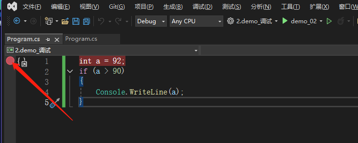

# 代码注释、折叠

## 代码注释

- 单行注释

```C#
// 单行注释
```

- 多行注释

```c#
/* */
/*
 *作者：
 *时间：
 * **/
```

- 文档注释

```C#
/// <summary>
/// 提交功能
/// </summary>
/// <param name="num">数字</param>
```

## 代码折叠

```C#
// region开始 endregion结束
#region （说明）
#endregion
```


# 变量、常量

## 变量

### 数据类型

- 整型：int、short、long
- 浮点型：float、double
- 字符串：string
- 字符：char
- 布尔型：bool

### 命名规则

- 英文字母、数字、"_"
- 开头：英文字母、"_"

## 常量

### 命名规则

- 有意义
- 均大写
- 长度不宜过长

### 使用规范

- 不随意修改，只能在初始化时赋值
- 多出引用
- 其值有特定含义
- const定义为常量

## 运算符

优先级

1. 括号 "()"
2. 一元运算符 ++，--
3. 算术运算符 * ，/，%（取模：获取余数），+，-
4. 关系运算符 >，>=，<，<=，==，!=
5. 逻辑运算符 &&，||，!，与，或，非
6. 条件运算符和赋值运算符 ?:，=，*=，/=，+=，-=

## 字符串拼接

- 推荐语法（.net6 C#11 C#5之后出现了$

```c#
string name = "张三";
int age = 19;
string hobby = "打篮球";
string info = $"姓名：{name}，年龄：{age}，爱好：{hobby}";
Console.WriteLine(info);
```

- "+"拼接
- 占位符

```C#
Console.WriteLine("姓名：{0}，年龄：{1}", name, age);
```

- string.Format() 字符串格式化

```c#
string info = string.Format("姓名：{0}，年龄：{1}", name, age);
Console.WriteLine(info);
```



